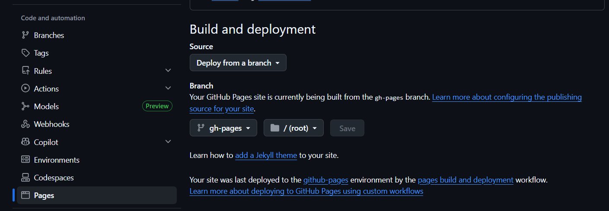

# 🚀 Getting Started

## 🖥 Local Setup

### 1️⃣ Install Dependencies

```bash
npm install
```

### 2️⃣ Start Development Server

```bash
npm run dev
```

App will run at:

```
http://localhost:5173
```

## 🌍 Deploy to GitHub Pages (Vite + React)

### 1️⃣ Install `gh-pages`

```bash
npm install gh-pages --save-dev
```

### 2️⃣ Update `package.json`

Add **homepage** and deploy scripts.

```json
"homepage": "https://YOUR_USERNAME.github.io/REPO_NAME"
```

**Scripts**

```json
"predeploy": "npm run build",
"deploy": "gh-pages -d dist"
```

**✅ Example (Final Version)**

```json
{
  "homepage": "https://nirmalakumarsahu.github.io/test-react-portfolio",
  "scripts": {
    "dev": "vite",
    "build": "tsc -b && vite build",
    "lint": "eslint .",
    "preview": "vite preview",
    "predeploy": "npm run build",
    "deploy": "gh-pages -d dist"
  }
}
```

### 3️⃣ Configure Vite Base Path

Open **vite.config.js**

```js
export default defineConfig({
  base: "/REPO_NAME/",
});
```

**✅ Example (Final Version)**

```js
import { defineConfig } from "vite";
import react from "@vitejs/plugin-react";

export default defineConfig({
  plugins: [react()],
  base: "/test-react-portfolio/",
});
```

⚠️ Make sure the base matches your repository name exactly.

### 4️⃣ Deploy

Run:

```bash
npm run deploy
```

This will:

- Build project
- Create `gh-pages` branch
- Deploy to GitHub Pages

### 5️⃣ GitHub Page Setting

- Go to `Repository → Settings → Pages`

- Then change the branch to `gh-pages` then click on `Save`



### 🌐 Live URL

After deployment:

```
https://YOUR_USERNAME.github.io/REPO_NAME/
```

## ⚠️ Important Notes

✔ Always run `npm run deploy` after making changes

✔ If images break → use `./assets/image.png`

✔ Always rebuild after changing `vite.config.js`

## 🎉 Done!

Your Vite + React app is now successfully deployed on GitHub Pages 🚀
